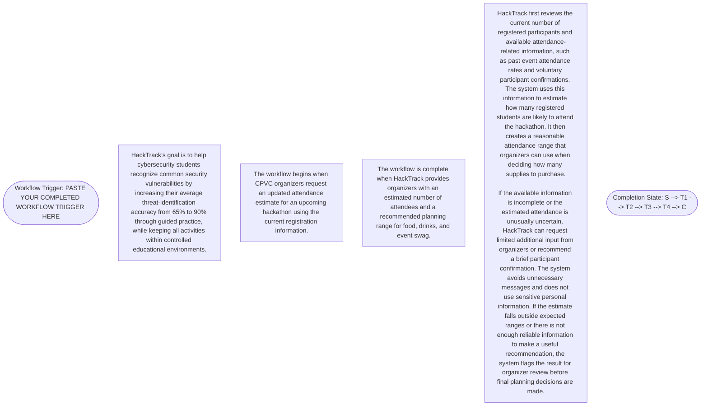

# Workflow of Tasks

*Replace all bracketed prompts with information specific to your proposed system. Delete instructional text that does not belong in your final specification. Add or remove task sections as needed. Every task shown in the general workflow must have a corresponding task specification below.*

## 1. Workflow Overview
### 1.1 Workflow Goal
This workflow supports the system goal defined in `my_first_agent/README.md`.

### 1.2 Workflow Trigger

The workflow begins when CPVC organizers request an updated attendance estimate for an upcoming hackathon using the current registration information.
### 1.3 Completion Condition at Runtime

The workflow is complete when HackTrack provides organizers with an estimated number of attendees and a recommended planning range for food, drinks, and event swag.
### 1.4 General Workflow
HackTrack first reviews the current number of registered participants and available attendance-related information, such as past event attendance rates and voluntary participant confirmations. The system uses this information to estimate how many registered students are likely to attend the hackathon. It then creates a reasonable attendance range that organizers can use when deciding how many supplies to purchase.

If the available information is incomplete or the estimated attendance is unusually uncertain, HackTrack can request limited additional input from organizers or recommend a brief participant confirmation. The system avoids unnecessary messages and does not use sensitive personal information. If the estimate falls outside expected ranges or there is not enough reliable information to make a useful recommendation, the system flags the result for organizer review before final planning decisions are made.

### 1.5 Workflow Diagram

