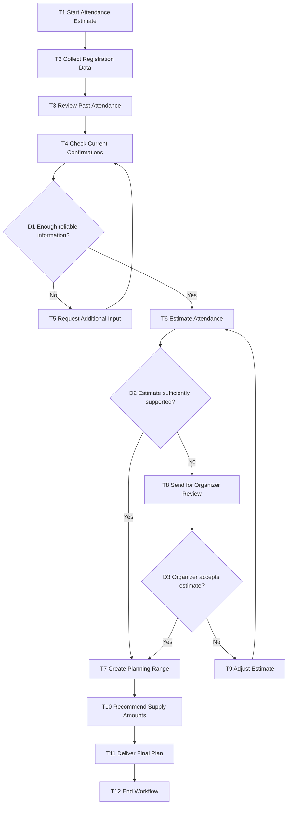

# Workflow of Tasks

## 1. Workflow Overview

### 1.1 Workflow Goal

This workflow supports the system goal defined in `my_first_agent/README.md` by helping CPVC organizers estimate hackathon attendance and plan appropriate quantities of food, drinks, and event swag.

### 1.2 Workflow Trigger

The workflow begins when CPVC organizers request an updated attendance estimate for an upcoming hackathon using the current registration information.

### 1.3 Completion Condition at Runtime

The workflow is complete when HackTrack provides organizers with an estimated number of attendees and a recommended planning range for food, drinks, and event swag.

### 1.4 General Workflow

HackTrack first collects the current registration information for the upcoming hackathon. It then reviews available historical attendance information and current voluntary confirmation information to determine whether there is enough reliable information to estimate attendance.

If important information is missing, HackTrack requests limited additional input from the organizers. The system avoids unnecessary participant communication and does not use sensitive personal information.

Once enough information is available, HackTrack estimates the likely number of attendees using the current registration information, historical attendance patterns, and available confirmation signals. It then evaluates the estimate and creates a reasonable planning range that accounts for uncertainty.

If the attendance estimate is unusually uncertain, falls outside expected patterns, or is not sufficiently supported by the available information, HackTrack sends the estimate to a CPVC organizer for human review. If revisions are requested, the estimate is adjusted before continuing.

After an acceptable estimate and planning range are available, HackTrack recommends quantities of food, drinks, and event swag. The final attendance estimate, planning range, and supply recommendations are then provided to CPVC organizers for use in event planning.

### 1.5 Workflow Tasks

#### T1 — Start Attendance Estimate
**Automation level:** L1

Begin the workflow when a CPVC organizer requests an updated attendance estimate for an upcoming hackathon.

#### T2 — Collect Registration Data
**Automation level:** L1

Retrieve the current number of registered participants and the registration information needed for attendance planning.

#### T3 — Review Past Attendance
**Automation level:** L2

Review available historical hackathon registration and attendance information to identify relevant attendance patterns.

#### T4 — Check Current Confirmations
**Automation level:** L1

Review available voluntary participant confirmation information or other approved attendance signals.

#### T5 — Request Additional Input
**Automation level:** L1

Request limited additional information from the CPVC organizer when required information is missing or insufficient. Avoid unnecessary participant communication.

#### T6 — Estimate Attendance
**Automation level:** L3

Use the available registration information, historical attendance patterns, and current confirmation signals to produce an estimated number of attendees. Evaluate uncertainty and identify the main evidence supporting the estimate.

#### T7 — Create Planning Range
**Automation level:** L2

Convert the attendance estimate into a reasonable attendance range that organizers can use when planning event supplies.

#### T8 — Send for Organizer Review
**Automation level:** L1

Send the attendance estimate and supporting information to a CPVC organizer when the estimate is unusually uncertain, unsupported, or outside expected ranges.

#### T9 — Adjust Estimate
**Automation level:** L2

Revise the attendance estimate using organizer feedback or newly supplied information when human review identifies a necessary change.

#### T10 — Recommend Supply Amounts
**Automation level:** L2

Use the accepted attendance estimate and planning range to recommend appropriate quantities of food, drinks, and event swag.

#### T11 — Deliver Final Plan
**Automation level:** L1

Provide CPVC organizers with the final attendance estimate, planning range, and supply recommendations.

#### T12 — End Workflow
**Automation level:** L1

Confirm that the required planning information has been delivered and mark the workflow as complete.

### 1.6 Material Decisions and Exceptions

**D1 — Is enough reliable information available?**

- **Yes:** Continue to T6 — Estimate Attendance.
- **No:** Continue to T5 — Request Additional Input, then recheck the available information.

**D2 — Is the estimate sufficiently supported and within an expected range?**

- **Yes:** Continue to T7 — Create Planning Range.
- **No:** Continue to T8 — Send for Organizer Review.

**D3 — Does the organizer accept the estimate?**

- **Yes:** Continue to T10 — Recommend Supply Amounts.
- **No:** Continue to T9 — Adjust Estimate, then reevaluate the estimate before proceeding.

### 1.7 Workflow Diagram

```mermaid
flowchart TD
    T1[T1 Start Attendance Estimate]
    T2[T2 Collect Registration Data]
    T3[T3 Review Past Attendance]
    T4[T4 Check Current Confirmations]
    D1{D1 Enough reliable information?}
    T5[T5 Request Additional Input]
    T6[T6 Estimate Attendance]
    D2{D2 Estimate sufficiently supported?}
    T7[T7 Create Planning Range]
    T8[T8 Send for Organizer Review]
    D3{D3 Organizer accepts estimate?}
    T9[T9 Adjust Estimate]
    T10[T10 Recommend Supply Amounts]
    T11[T11 Deliver Final Plan]
    T12[T12 End Workflow]

    T1 --> T2
    T2 --> T3
    T3 --> T4
    T4 --> D1

    D1 -- No --> T5
    T5 --> T4
    D1 -- Yes --> T6

    T6 --> D2
    D2 -- Yes --> T7
    D2 -- No --> T8

    T8 --> D3
    D3 -- No --> T9
    T9 --> T6
    D3 -- Yes --> T7

    T7 --> T10
    T10 --> T11
    T11 --> T12
```
